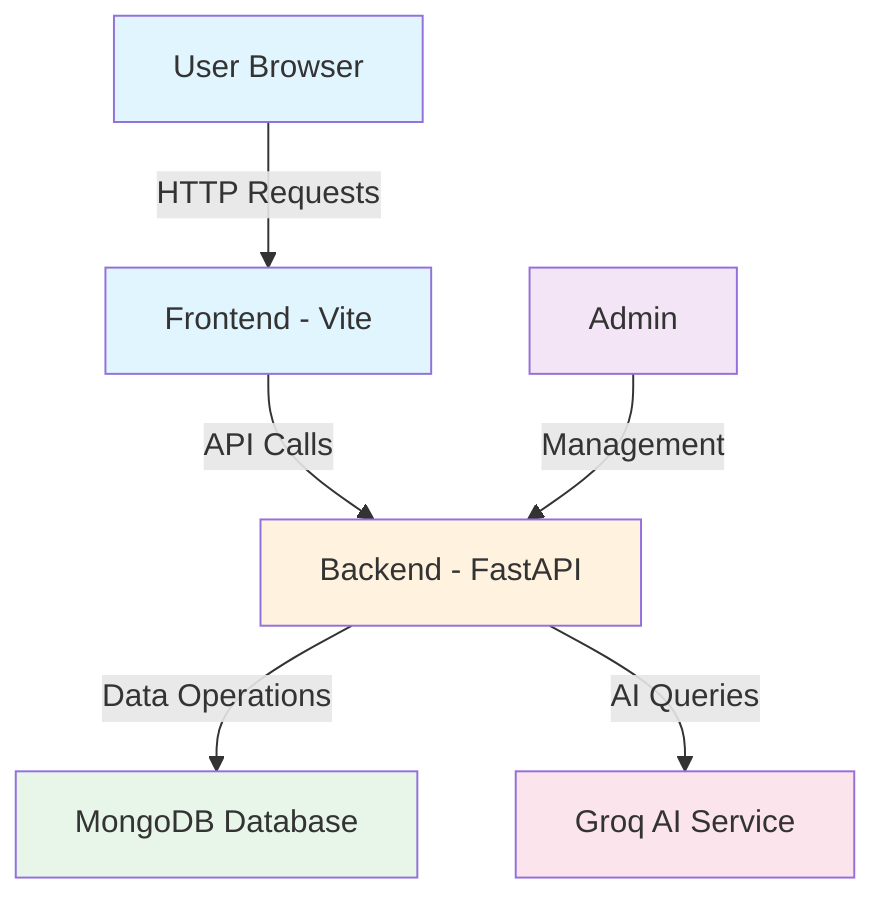

# Project Overview

## Terminologies

This document explains all technical terms used in this e-commerce project.

### General Terms

| Term | Meaning |
|------|---------|
| **API** | Application Programming Interface - a way for two programs to talk to each other |
| **Backend** | The server-side code that handles data and business logic |
| **Frontend** | The user interface that users see and interact with |
| **Database** | A place where data is stored electronically |
| **Route** | A specific URL path that handles a request |

### Technology Stack

| Term | Meaning |
|------|---------|
| **FastAPI** | A Python framework for building APIs quickly |
| **MongoDB** | A document-based database that stores data in JSON-like format |
| **Vite** | A fast build tool for modern web applications |
| **Axios** | A JavaScript library for making HTTP requests |
| **Pydantic** | A Python library for data validation |
| **bcrypt** | A library for hashing passwords securely |
| **Groq** | An AI service used for the chatbot |

### Authentication Terms

| Term | Meaning |
|------|---------|
| **JWT** | (Conceptually) Token used for user authentication |
| **Password Hashing** | Converting passwords into a secure format before storing |
| **CORS** | Cross-Origin Resource Sharing - allows frontend to talk to backend |

### Data Models

| Term | Meaning |
|------|---------|
| **User** | A person who registers or logs into the store |
| **Product** | An item available for sale in the store |
| **Order** | A record of a purchase |
| **CartItem** | An item added to the shopping cart |

### Application Terms

| Term | Meaning |
|------|---------|
| **Router** | Handles different URL paths in the application |
| **Collection** | A table in MongoDB where data is stored |
| **Middleware** | Code that runs before or after each request |
| **Static Files** | Files like images that are served directly |

### User Roles

| Role | Access |
|------|--------|
| **user** | Can browse products, add to cart, place orders |
| **admin** | All user permissions plus can add/edit/delete products |

---

## Project Summary

This is a full-stack e-commerce application with:
- **Backend**: Python FastAPI server
- **Frontend**: Vanilla JavaScript with Vite
- **Database**: MongoDB (NoSQL)
- **Features**: User authentication, product management, shopping cart, AI chatbot

## Quick Links

- [Backend Documentation](./02-backend/)
- [Frontend Documentation](./03-frontend/)
- [Database Documentation](./04-database/)
- [Models Documentation](./05-models/)
