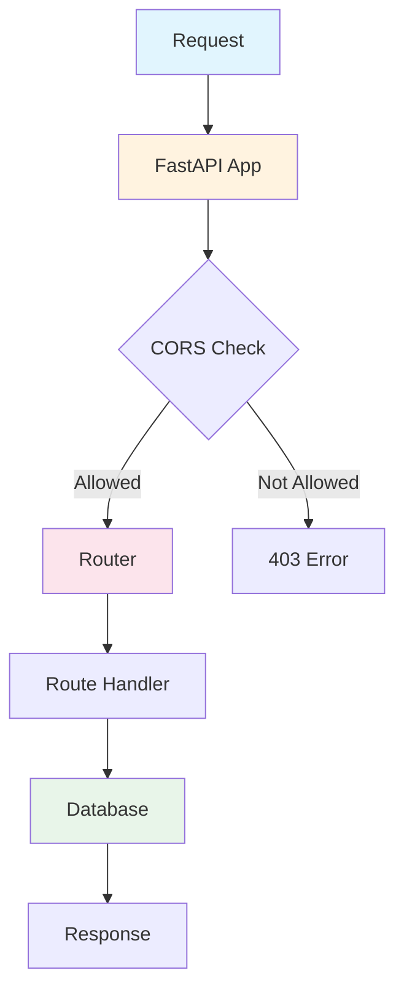

# Main Application (main.py)

## Purpose

This file is the entry point of the FastAPI application. It sets up the server and includes all route modules.

## What It Does

1. **Creates FastAPI App** - Initializes the main application
2. **Sets Up CORS** - Allows the frontend to communicate with the backend
3. **Includes Routers** - Connects all the different route modules
4. **Serves Static Files** - Makes uploaded images accessible via URL

## Key Components

```python
# Creates the FastAPI application
app = FastAPI()

# Sets up CORS for frontend connection
setup_cors(app)

# Includes all route modules
app.include_router(auth.router)
app.include_router(products.router)
app.include_router(orders.router)
app.include_router(cart.router)
app.include_router(chatbot.router)

# Serves uploaded files statically
app.mount("/uploads", StaticFiles(directory="uploads"), name="uploads")
```

## Endpoints

| Endpoint | Description |
|----------|-------------|
| `GET /` | Returns a welcome message |

## File Structure

```
backend/
├── main.py              # Main application (this file)
├── config.py            # CORS configuration
├── database.py          # Database connection
├── models.py            # Data models
├── routes/
│   ├── auth.py          # Authentication (register, login)
│   ├── products.py      # Product management
│   ├── orders.py        # Order processing
│   ├── cart.py          # Shopping cart
│   └── chatbot.py       # AI chatbot
```

## How It Works


