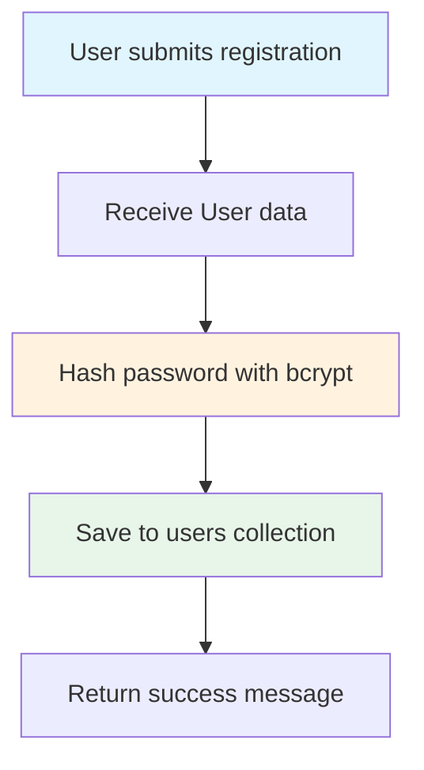
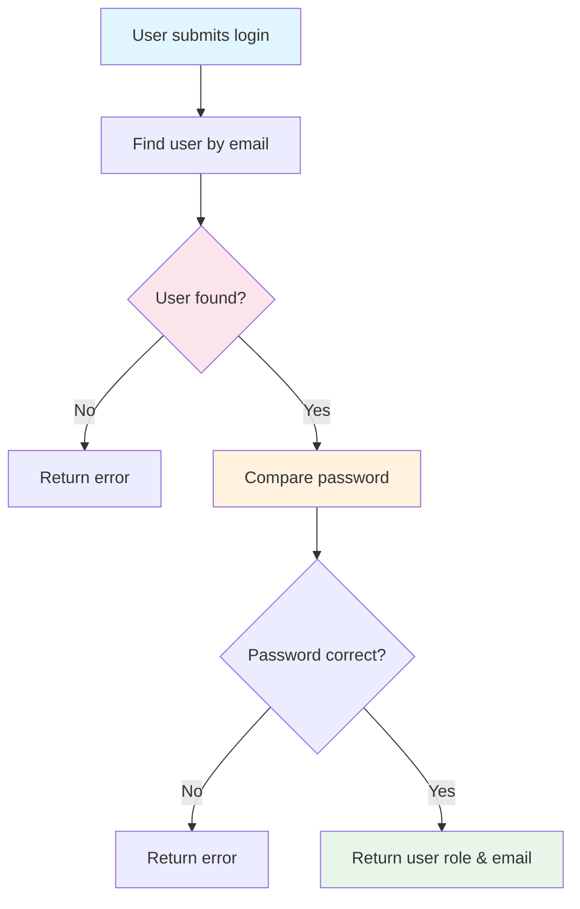

# Authentication Routes (auth.py)

## Purpose

Handles user registration and login operations.

## What It Does

1. **Register** - Creates a new user account with hashed password
2. **Login** - Verifies user credentials and returns user info

## Endpoints

| Method | Path | Description |
|--------|------|-------------|
| POST | `/register` | Create a new user account |
| POST | `/login` | Login and get user details |

## Registration Flow



## Login Flow



## Data Models Used

### User Model
```python
class User(BaseModel):
    name: str          # User's full name
    email: str         # User's email (unique)
    password: str     # User's password (will be hashed)
    role: str = "user" # Role (default: "user")
```

### LoginUser Model
```python
class LoginUser(BaseModel):
    email: str    # User's email
    password: str # User's password
```

## Security Features

- **Password Hashing**: Uses bcrypt to hash passwords before storing
- **Salt Generation**: Each password gets a unique salt for security
- **Credential Verification**: Passwords are verified using bcrypt comparison
