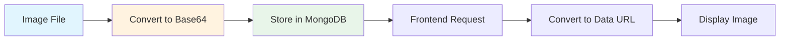

# Product Routes (products.py)

## Purpose

Manages all product-related operations like adding, viewing, updating, and deleting products.

## What It Does

1. **Add Product** - Creates a new product with image
2. **Get Products** - Retrieves all products or filters by category
3. **Update Product** - Modifies an existing product
4. **Delete Product** - Removes a product from the database

## Endpoints

| Method | Path | Description |
|--------|------|-------------|
| POST | `/products` | Add a new product |
| GET | `/products` | Get all products (with optional category filter) |
| PUT | `/products/{id}` | Update a product |
| DELETE | `/products/{id}` | Delete a product |
| DELETE | `/products` | Delete all products |
| POST | `/products/bulk` | Add multiple products |

## Product Structure

```python
class Product(BaseModel):
    name: str          # Product name
    description: str   # Product description
    price: int         # Product price
    category: str      # Category (men, women, kids)
    size: List[str]    # Available sizes
    color: List[str]   # Available colors
    image: str         # Image (stored as base64)
```

## Image Handling

Products support image upload:
- Images are converted to **Base64** format
- Stored directly in MongoDB
- Converted back to data URL for display



## Category Filtering

The GET endpoint supports filtering by category:
- `GET /products` - Returns all products
- `GET /products?category=men` - Returns only men's products
- `GET /products?category=women` - Returns only women's products

## Key Functions

| Function | Purpose |
|----------|---------|
| `add_product()` | Handles multipart form data with image upload |
| `get_products()` | Fetches products with optional category filter |
| `update_product()` | Updates product fields (partial update supported) |
| `delete_product()` | Removes a single product by ID |
| `delete_all_products()` | Removes all products |
