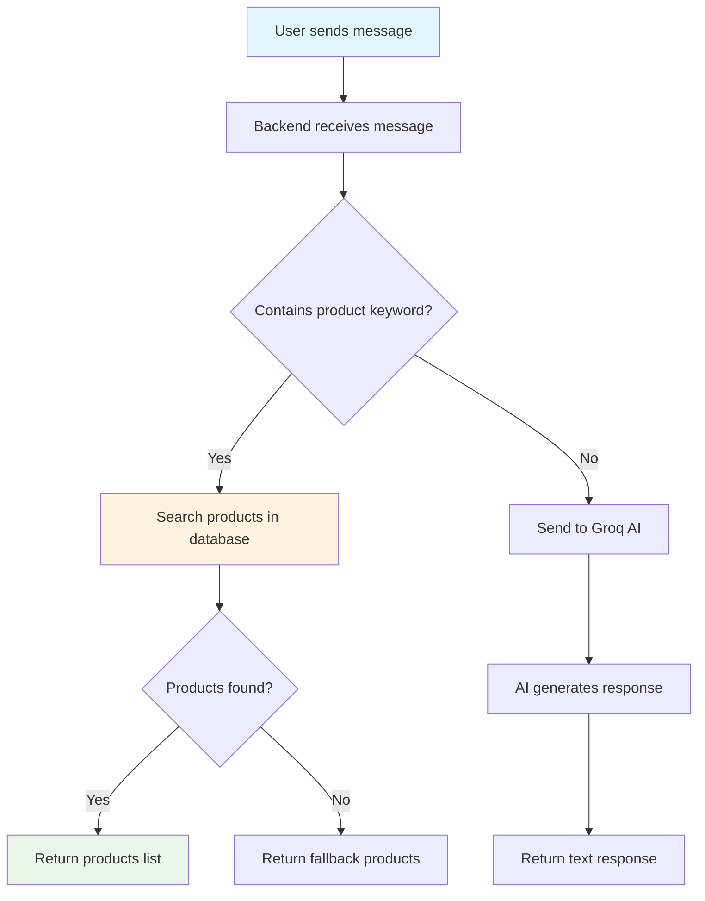

# Chatbot Routes (chatbot.py)

## Purpose

Provides an AI-powered chatbot assistant that helps users find products.

## What It Does

1. **Product Search** - Searches products based on user keywords
2. **AI Responses** - Uses Groq AI for general queries
3. **Smart Filtering** - Filters by category, product name, and price

## Endpoints

| Method | Path | Description |
|--------|------|-------------|
| POST | `/chat` | Send message and get AI response |

## Chat Flow

## Supported Keywords

### Categories
- **men** - Men's products
- **women** - Women's products  
- **kids** - Kids products

### Product Types
- shirt, dress, shoe, watch, jacket, tshirt, jeans, kurta, saree, kurti, top, salwar, lehenga

### Price Filters
- under 1000, under 2000, under 500, under 3000

## Example Queries

| User Message | Response Type |
|--------------|---------------|
| "show me men's shirts" | Products (men category) |
| "women kurti under 2000" | Products (women + price filter) |
| "what is your return policy?" | Text (AI response) |
| "kids dress" | Products (kids category) |

## AI Integration

Uses **Groq API** with Llama 3.1 model for natural language responses. The AI is provided with:
- System context about the e-commerce store
- Sample of available products
- Instructions to be helpful and friendly

## Fallback Behavior

If Groq API fails, the system falls back to showing popular products from the database.
