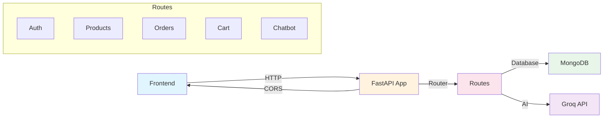

# Backend Documentation

## Table of Contents

1. [Main Application](01-main-app.md)
2. [Authentication Routes](02-auth-routes.md)
3. [Product Routes](03-product-routes.md)
4. [Order Routes](04-order-routes.md)
5. [Cart Routes](05-cart-routes.md)
6. [Chatbot Routes](06-chatbot-routes.md)
7. [Configuration](07-config.md)
8. [Database Setup](08-database.md)
9. [Models](09-models.md)

---

## Overview

The backend is built with **FastAPI**, a modern Python web framework. It handles all server-side operations including:

- User authentication (register, login)
- Product management (add, update, delete, fetch)
- Order processing
- Shopping cart operations
- AI-powered chatbot

### Architecture



### Running the Backend

```bash
cd backend
uvicorn main:app --reload
```

The backend runs on `http://127.0.0.1:8000`
