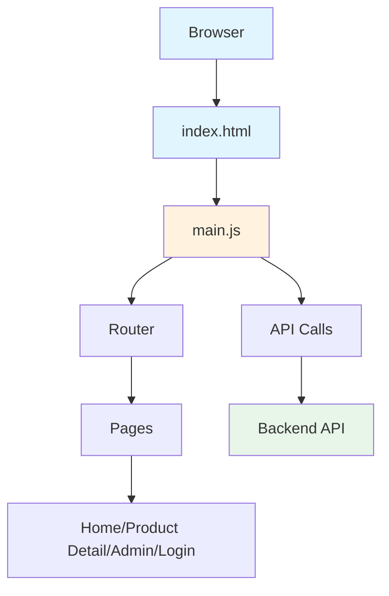

# Frontend Documentation

## Table of Contents

1. [Application Entry](01-main-js.md)
2. [Styling](02-styling.md)

---

## Overview

The frontend is a **Vanilla JavaScript** application built with **Vite** as the build tool. It provides the user interface for the e-commerce store.

### Features

- User Registration and Login
- Product Browsing with Categories
- Product Details View
- Shopping Cart
- Admin Dashboard for Product Management
- AI Chatbot Assistant

### Architecture



### Running the Frontend

```bash
cd Frontend
npm run dev
```

The frontend runs on `http://localhost:5173`
