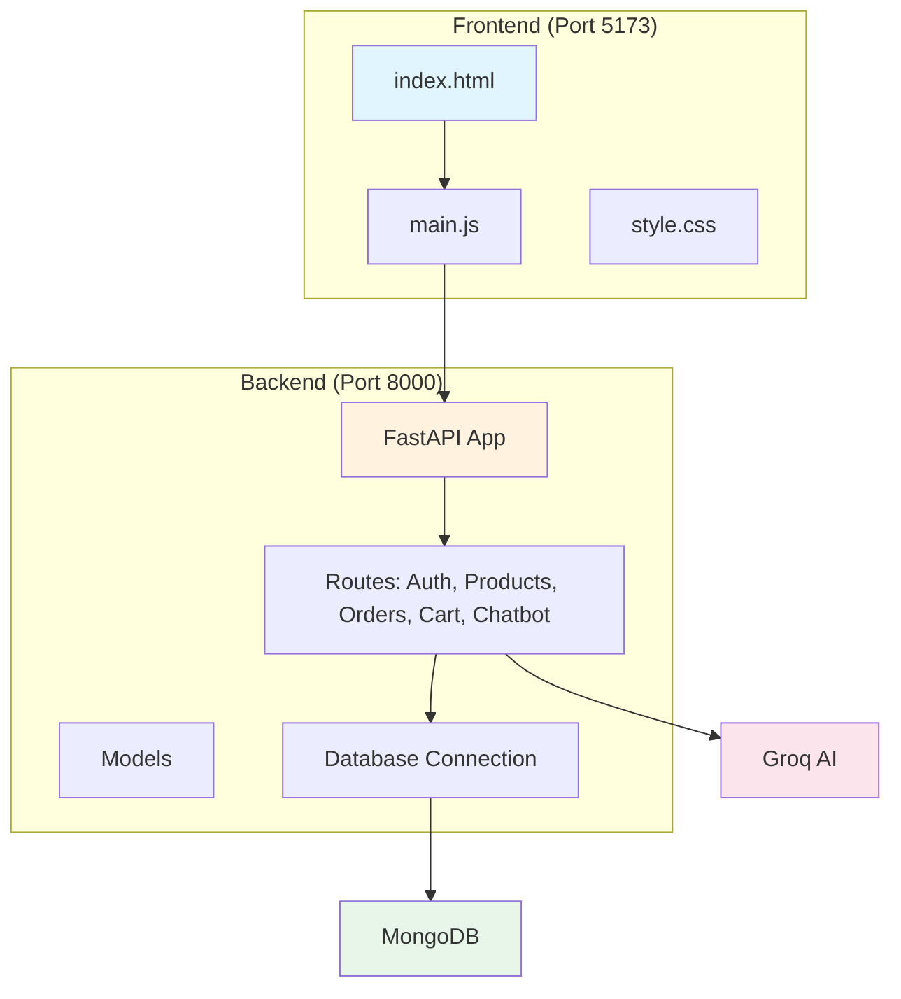

# Documentation Index

Welcome to the LUXE E-Commerce Store documentation.

## Quick Navigation

### 1. Project Overview
- **Purpose**: Learn about the project and all terminologies
- **File**: [01-project-overview/README.md](./01-project-overview/README.md)

### 2. Backend Documentation
| Document | Description |
|----------|-------------|
| [README](./02-backend/README.md) | Backend overview |
| [main.py](./02-backend/01-main-app.md) | Main application entry |
| [auth.py](./02-backend/02-auth-routes.md) | Authentication routes |
| [products.py](./02-backend/03-product-routes.md) | Product management |
| [orders.py](./02-backend/04-order-routes.md) | Order processing |
| [cart.py](./02-backend/05-cart-routes.md) | Shopping cart |
| [chatbot.py](./02-backend/06-chatbot-routes.md) | AI chatbot |
| [config.py](./02-backend/07-config.md) | CORS configuration |
| [database.py](./02-backend/08-database.md) | Database setup |
| [models.py](./02-backend/09-models.md) | Data models |

### 3. Frontend Documentation
| Document | Description |
|----------|-------------|
| [README](./03-frontend/README.md) | Frontend overview |
| [main.js](./03-frontend/01-main-js.md) | Application entry point |
| [style.css](./03-frontend/02-styling.md) | Styling guide |

### 4. Database Documentation
- [README](./04-database/README.md) - MongoDB structure and collections

### 5. Models Documentation
- [README](./05-models/README.md) - Data model definitions

---

## Project Architecture



## Technology Stack

| Layer | Technology |
|-------|------------|
| Frontend Framework | Vite + Vanilla JS |
| Backend Framework | FastAPI (Python) |
| Database | MongoDB |
| AI Service | Groq (Llama 3.1) |
| Password Hashing | bcrypt |
| Data Validation | Pydantic |

## User Roles

| Role | Permissions |
|------|-------------|
| **user** | Browse products, add to cart, place orders |
| **admin** | All user permissions + add/edit/delete products |

## API Endpoints Summary

| Method | Endpoint | Description |
|--------|----------|-------------|
| POST | `/register` | Register new user |
| POST | `/login` | Login user |
| GET | `/products` | Get all products |
| POST | `/products` | Add product (admin) |
| PUT | `/products/{id}` | Update product (admin) |
| DELETE | `/products/{id}` | Delete product (admin) |
| POST | `/orders` | Place order |
| POST | `/cart/add` | Add to cart |
| GET | `/cart/{email}` | Get cart items |
| POST | `/chat` | Chat with AI |

---

## Getting Started

### Prerequisites
- Node.js (for frontend)
- Python 3.8+ (for backend)
- MongoDB

### Running the Application

1. **Start Backend:**
   ```bash
   cd backend
   uvicorn main:app --reload
   ```

2. **Start Frontend:**
   ```bash
   cd Frontend
   npm run dev
   ```

3. Open browser at `http://localhost:5173`
